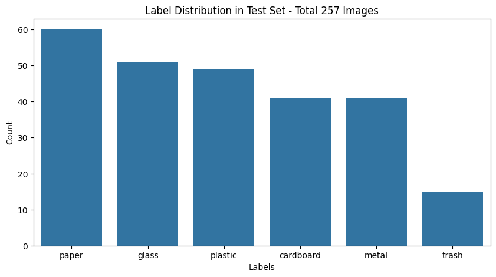

# Laporan Proyek Machine Learning - Mario Valerian Rante Ta'dung

### Ringkasan Proses Proyek Trash Classification

- **Persiapan Data:**
  - Download dan ekstrak dataset sampah dari Kaggle.
  - Bagi dataset menjadi train, validation, dan test dengan rasio 80:10:10 menggunakan `splitfolders`.
  - Load gambar dan label dari folder, serta visualisasi distribusi kelas.

- **Pembuatan Dataset TensorFlow:**
  - Buat dataset dari folder menggunakan `image_dataset_from_directory`.
  - Terapkan cache, shuffle, dan prefetch untuk optimasi loading data.
  - Simpan nama kelas (class indices) untuk evaluasi dan visualisasi.

- **Augmentasi dan Preprocessing:**
  - Data augmentation: random flip, rotation, zoom, dan contrast.
  - Preprocessing khusus untuk model ResNetV2 (scaling ke [-1,1]) dan normalisasi untuk model lain.

- **Modeling:**
  - Bangun model ResNet50V2 pretrained tanpa top layer.
  - Tambahkan layer pooling, batch normalization, dropout, dan dense dengan regularisasi L2.
  - Kompilasi model dengan optimizer Adam (atau AdamW), loss categorical crossentropy, dan metrik akurasi, precision, recall, dan F1-score.

- **Training:**
  - Gunakan callback untuk checkpoint, early stopping, dan tensorboard.
  - Latih model selama beberapa epoch, simpan model terbaik berdasarkan val_accuracy.

- **Evaluasi:**
  - Plot metrik training dan validation (accuracy, loss, precision, recall, F1-score) dalam subplot.
  - Evaluasi model di data test untuk mendapatkan metrik final.

- **Analisis Hasil:**
  - Prediksi kelas pada test set.
  - Buat confusion matrix dan visualisasikan dengan label kelas untuk analisis kesalahan prediksi.

## 1. Domain Proyek

### 1.1 Latar Belakang

Saat ini, pengolahan sampah masih menjadi tantangan global yang dihadapi oleh berbagai negara, salah satunya adalah Indonesia. Dilansir dari laman Badan Riset dan Inovasi Nasional (BRIN), terdapat 31,9 juta ton timbunan sampah nasional per 24 Juli 2024 [1]. Dari keseluruhan sampah yang dihasilkan secara nasional, sekitar 63,3% atau setara dengan 20,5 juta ton berhasil dikelola dengan baik. Namun, masih terdapat 35,67% atau sekitar 11,3 juta ton sampah yang belum tertangani secara optimal. Jika dibandingkan dengan tahun 2018, menurut Riset Sustainable Waste Indonesia (SWI), terjadi peningkatan yang cukup drastis dimana terdapat 24% sampah di Indonesia masih belum dikelola pada tahun tersebut [2]. Kondisi ini menunjukkan bahwa meskipun mayoritas sampah telah dikelola, proporsi sampah yang belum tertangani mengalami peningkatan signifikan dalam kurun waktu enam tahun terakhir, dari 24% pada tahun 2018 menjadi 35,67% pada tahun 2024. Kenaikan lebih dari 11 persen ini menandakan adanya kesenjangan antara pertumbuhan volume sampah dengan kapasitas sistem pengelolaan yang tersedia.

Sampah yang tidak terkelola dengan baik dapat menimbulkan berbagai dampak negatif. Kondisi ini membawa dampak yang sangat signifikan, terutama pada aspek ekonomi dan sosial. Secara ekonomi, kerugian akibat sampah plastik yang bocor ke laut diperkirakan mencapai Rp250 triliun per tahun, yang berdampak pada sektor maritim, kelautan, dan perikanan serta menurunkan potensi pendapatan negara [3]. Di sisi lain, studi komprehensif yang dilakukan oleh Kementerian Lingkungan Hidup dan Kehutanan (KLHK) bersama Kementerian Perindustrian (Kemenperin) dan Bappenas menunjukkan bahwa penutupan 343 tempat pembuangan akhir (TPA) open dumping dan transformasi menuju sistem pengelolaan sampah terintegrasi memiliki potensi ekonomi yang sangat besar [4]. Hasil studi tersebut mengidentifikasi tujuh sektor bisnis potensial dengan nilai ekonomi total mencapai Rp127,5 triliun per tahun, termasuk di antaranya industri daur ulang material, produksi kompos, pembangkit listrik berbasis sampah, hingga jasa konsultasi dan teknologi pengelolaan sampah. Selain membuka peluang usaha baru, transformasi ini juga berpotensi menciptakan lapangan kerja, meningkatkan pendapatan masyarakat, dan mempercepat peralihan menuju ekonomi sirkular yang berkelanjutan. Dengan demikian, pengelolaan sampah yang optimal tidak hanya mengurangi kerugian ekonomi, tetapi juga membuka peluang penyerapan tenaga kerja dan peningkatan kesejahteraan masyarakat secara lebih luas.

Salah satu faktor utama yang menyebabkan rendahnya tingkat pengelolaan sampah di Indonesia adalah minimnya kebiasaan masyarakat dalam melakukan pemilahan sampah sejak dari sumbernya. Berdasarkan survei yang dilakukan oleh Pierre Rainer dan dipublikasikan melalui laman GoodStats [5], mayoritas responden (61,6%) menyatakan keinginan untuk memilah sampah namun terhambat oleh ketiadaan fasilitas yang memadai. Selain itu, sebanyak 47% responden mengaku tidak memiliki waktu untuk melakukan pemilahan, sementara 6,8% lainnya menyatakan bahwa mereka tidak menganggap pemilahan sampah sebagai tanggung jawab pribadi. Temuan ini menunjukkan bahwa perilaku pemilahan sampah sangat dipengaruhi oleh ketersediaan infrastruktur serta kesadaran individu terhadap tanggung jawab lingkungan.

Kemajuan dalam bidang kecerdasan buatan, khususnya pada teknologi computer vision, telah membuka peluang baru dalam mengatasi tantangan pemilahan sampah. Dengan memanfaatkan algoritma pembelajaran mesin untuk mengenali dan mengklasifikasikan citra sampah, proses yang sebelumnya bergantung pada tenaga manusia kini dapat diotomatisasi. Inovasi ini memungkinkan identifikasi sampah organik dan anorganik secara langsung dari gambar, tanpa perlu intervensi manual. Penerapan teknologi semacam ini sangat relevan di Indonesia, di mana sebagian besar masyarakat belum terbiasa melakukan pemilahan sejak dari rumah. Dengan sistem klasifikasi otomatis berbasis citra, upaya pemilahan dapat dilakukan lebih konsisten dan cepat, sekaligus mengurangi beban kerja petugas pengelola sampah serta meningkatkan efisiensi sistem pengolahan secara keseluruhan. Meskipun masih memerlukan peningkatan akurasi dan adaptasi terhadap kondisi lokal, pendekatan ini merupakan langkah awal menuju sistem pengelolaan sampah yang lebih modern dan berkelanjutan.

## 2. Business Understanding

### 2.1 Problem Statements

### **Problem Statement 1**

**Rendahnya tingkat pengelolaan sampah di Indonesia disebabkan oleh kesenjangan antara pertumbuhan volume sampah dengan kapasitas sistem pengelolaan yang tersedia**, yang terbukti dari meningkatnya proporsi sampah tidak terkelola dari 24% pada tahun 2018 menjadi 35,67% pada tahun 2024. Hal ini menunjukkan bahwa sistem pengelolaan sampah saat ini belum mampu mengikuti laju timbunan sampah yang terus meningkat.

### **Problem Statement 2**

**Minimnya kebiasaan masyarakat dalam memilah sampah sejak dari sumbernya menjadi hambatan utama dalam meningkatkan efisiensi pengelolaan sampah.** Survei menunjukkan bahwa sebagian besar masyarakat tidak memilah sampah karena kurangnya fasilitas, waktu, dan kesadaran tanggung jawab, sehingga diperlukan solusi inovatif yang dapat mendukung proses pemilahan secara otomatis dan mudah diakses.

### 2.2 Goals

1. **Mengembangkan model klasifikasi citra berbasis deep learning** yang mampu mengidentifikasi enam kategori sampah (Paper, Glass, Plastic, Metal, Cardboard, dan Trash) dengan tingkat akurasi pada data validasi yang dapat diterima (>80%) sebagai baseline awal.
2. **Memanfaatkan arsitektur CNN dan pendekatan transfer learning** untuk membandingkan performa serta mengidentifikasi pendekatan yang paling sesuai untuk klasifikasi multi-kelas sampah.
3. **Menyiapkan pipeline pemrosesan data dan augmentasi gambar** untuk meningkatkan generalisasi model terhadap berbagai kondisi pencahayaan dan orientasi citra.
4. **Menghasilkan model yang dapat digunakan sebagai prototipe awal** untuk sistem pendukung pemilahan sampah otomatis berbasis visual, sebagai bagian dari solusi menuju pengelolaan sampah yang lebih efisien.

## 3. Data Understanding

Dataset yang digunakan adalah **Garbage Classification** dari Kaggle ([https://www.kaggle.com/datasets/asdasdasasdas/garbage-classification](https://www.kaggle.com/datasets/asdasdasasdas/garbage-classification)). Terdiri atas 2.527 gambar dengan 6 kelas.

**Variabel/Fitur:**

* Input: citra RGB (ukuran bervariasi).
* Label: Paper, Glass, Plastic, Metal, Cardboard dan Trash

### **Distribusi Data**

## 4. Data Preparation

1. **Resize:** All images resized to 224×224 pixels.
2. **Data Augmentation (`create_data_augmentation`):**
   - `RandomFlip("horizontal")`
   - `RandomRotation(0.2)` (~20°)
   - `RandomZoom(0.2)` (20%)
   - `RandomContrast(0.1)` (10%)
3. **Preprocessing (`create_preprocessing`):**
   - For **ResNetV2**: Rescaling to [-1, 1] using `scale=1/127.5`, `offset=-1`.
   - For **other models**: Rescaling to [0, 1] using `1/255`, followed by normalization with:
     - `mean=[0.485, 0.456, 0.406]`
     - `variance=[0.229², 0.224², 0.225²]`
4. **Data Split:**
   - Train: 80%
   - Validation: 10%
   - Test: 10%

## 5. Modeling

**Model (Transfer Learning):** Resnet50V2 pretrained (imagenet) + head baru.

**Parameter:**

* Optimizer: Adam (lr=0.001)
* Batch size: 32
* Epochs: 20

## 6. Evaluation

**Metrik Evaluasi:** Akurasi, Precision, Recall, F1-score.

**Hasil:**

* Model A: Test Loss: 0.36955204606056213, Test Accuracy: 0.8677042722702026, Test Precision: 0.891566276550293, Test Recall: 0.8638132214546204, Test F1 Score: 0.8774703145027161

**Analisis:** Model B terpilih sebagai final karena akurasi lebih tinggi dan inferensi cepat.

## **Referensi**

\[1] 	"11,3 Juta Ton Sampah di Indonesia Tidak Terkelola dengan Baik," BRIN, 26 Juli 2024. [Online]. Available: https://brin.go.id/drid/posts/kabar/113-juta-ton-sampah-di-indonesia-tidak-terkelola-dengan-baik. [Accessed 24 Mei 2025].

\[2] 	"Riset: 24 Persen Sampah di Indonesia Masih Tak Terkelola," CNN Indonesia, 25 April 2018. [Online]. Available: https://www.cnnindonesia.com/gaya-hidup/20180425101643-282-293362/riset-24-persen-sampah-di-indonesia-masih-tak-terkelola. [Accessed 25 Mei 2025].

\[3] 	P. T. Violleta, "Peneliti BRIN: Kerugian ekonomi akibat sampah bisa capai Rp250 triliun," Antara, 30 April 2024. [Online]. Available: https://www.antaranews.com/berita/4082307/peneliti-brin-kerugian-ekonomi-akibat-sampah-bisa-capai-rp250-triliun. [Accessed 26 Mei 2025].

\[4] 	E. P. Putra, "Potensi Ekonomi Bisnis Sampah Nasional Capai Rp 127,5 Triliun per Tahun," Republika, 2 Maret 2025. [Online]. Available: https://news.republika.co.id/berita/sshqqb484/potensi-ekonomi-bisnis-sampah-nasional-capai-rp-1275-triliun-per-tahun-part2. [Accessed 26 Mei 2025].

\[5] 	P. Rainer, "Alasan Separuh Masyarakat RI Tidak Memilah Sampah," GoodStats, 22 Agustus 2023. [Online]. Available: https://data.goodstats.id/statistic/alasan-separuh-masyarakat-ri-tidak-memilah-sampah-5Dm7e. [Accessed 25 Mei 2025].

